# POC #01 - Node & React Setup

## Agile Management Board
- Link: [Github Project Board](https://github.com/users/OfficialApurvChatur/projects/18)

## System Architecture

### 01. High Level Design (HLD)
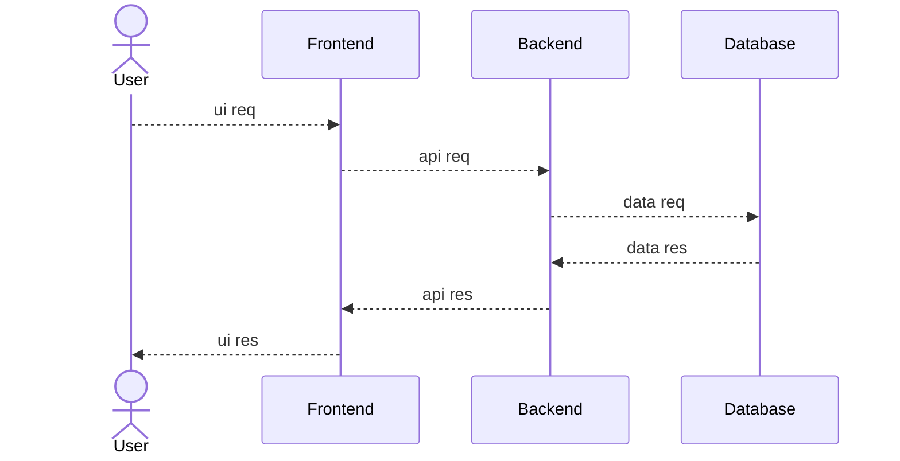
```mermaid
  sequenceDiagram
    actor User
    participant Frontend
    participant Backend
    participant Database

    User -->> Frontend : ui req
    Frontend -->> Backend : api req
    Backend -->> Database : data req
    Database -->> Backend : data res
    Backend -->> Frontend : api res
    Frontend -->> User : ui res
```

### 02. Low Level Design (LLD)

#### 01.01. Git Branching & PR Strategies Setup LLD
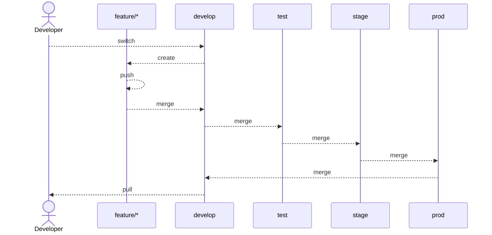
```mermaid
  sequenceDiagram
    actor Developer
    participant feature/*
    participant develop
    participant test
    participant stage
    participant prod

    Developer -->> develop : switch
    develop -->> feature/* : create
    feature/* -->> feature/* : push
    feature/* -->> develop : merge
    develop -->> test : merge
    test -->> stage : merge
    stage -->> prod : merge
    prod -->> develop : merge
    develop -->> Developer : pull
```

#### 01.02. Project Overview Setup LLD
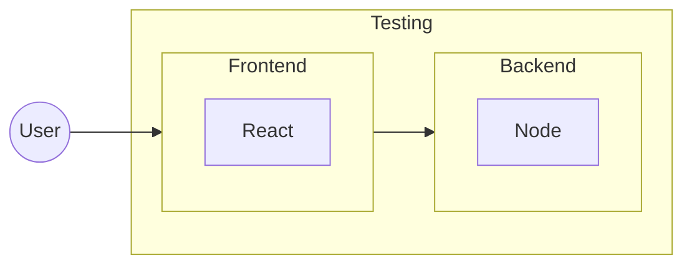
```mermaid
  flowchart LR
    User(("User"))
    subgraph Testing["Testing"]
      subgraph Frontend["Frontend"]
        React["React"]
      end

      subgraph Backend["Backend"]
        Node["Node"]
      end
    end

    User --> Frontend
    Frontend --> Backend
```

#### 01.03. Environmnet Setup LLD
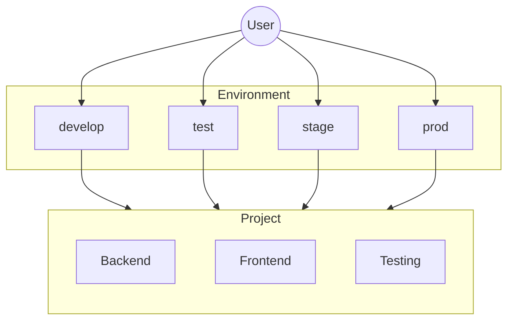
```mermaid
  flowchart
    User(("User"))
    subgraph Environment["Environment"]
      develop["develop"]
      test["test"]
      stage["stage"]
      prod["prod"]
    end
    subgraph Project["Project"]
      direction TB
      Backend["Backend"]
      Frontend["Frontend"]
      Testing["Testing"]
    end

    User --> develop
      develop --> Project
    User --> test
      test --> Project
    User --> stage
      stage --> Project
    User --> prod
      prod --> Project
```

#### 01.04. Playwright Setup LLD
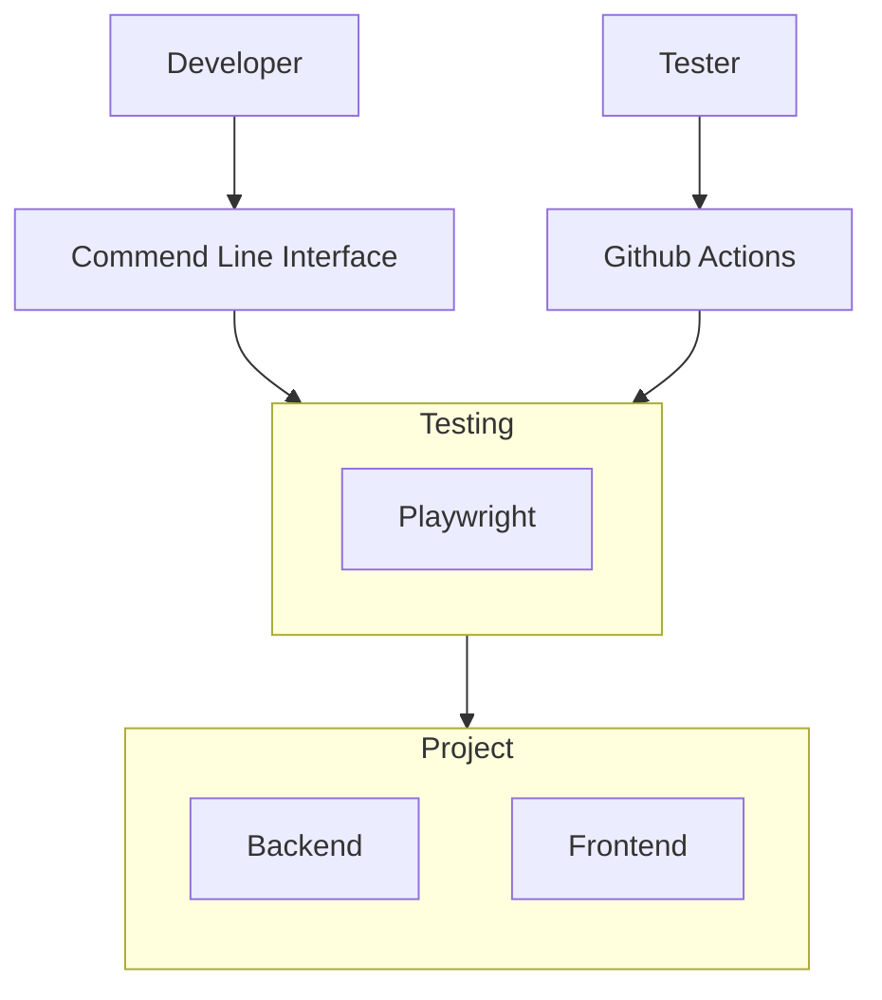
```mermaid
  flowchart
    Developer["Developer"]
      CLI["Commend Line Interface"]
    Tester["Tester"]
      GithubActions["Github Actions"]
    subgraph Testing["Testing"]
      Playwright["Playwright"]
    end
    subgraph Project["Project"]
      direction TB
      Backend["Backend"]
      Frontend["Frontend"]
    end

    Developer --> CLI
    Tester --> GithubActions
      CLI --> Testing
      GithubActions --> Testing
        Testing --> Project
```

#### 01.05. Servers & DNS Setup LLD
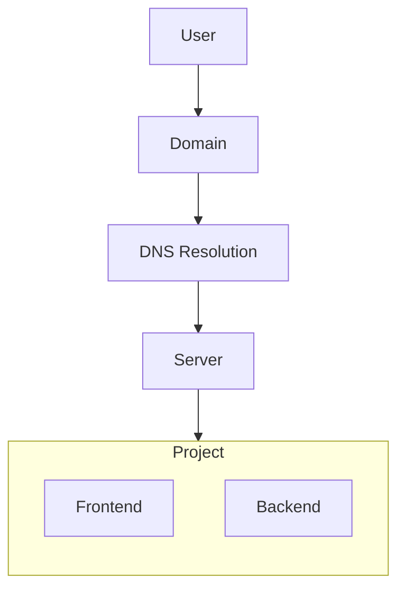
```mermaid
  flowchart
    User["User"]
    Domain["Domain"]
    DNS["DNS Resolution"]
    Server["Server"]
    subgraph Project["Project"]
      direction TB
      Frontend["Frontend"]
      Backend["Backend"]
    end

    User --> Domain
    Domain --> DNS
    DNS --> Server
    Server --> Project
```

#### 01.06. CI/CD Deployment Setup LLD 
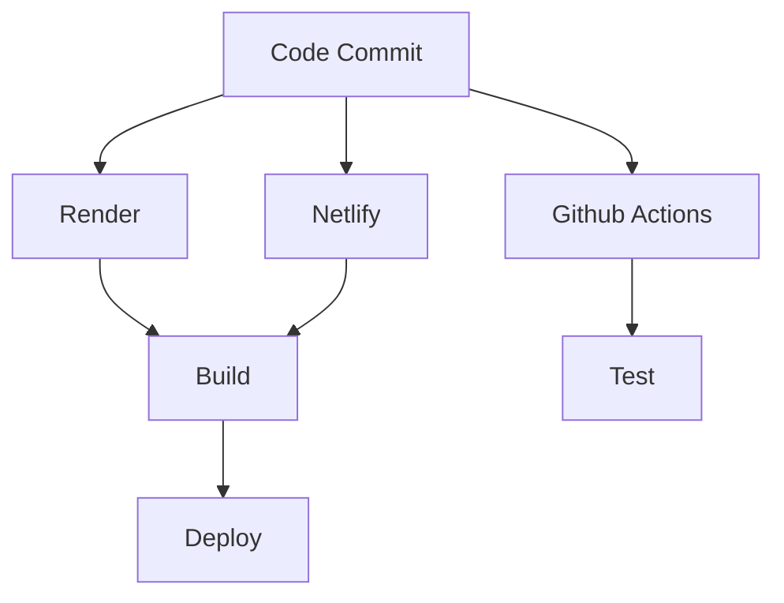
```mermaid
  flowchart
    Code["Code Commit"]
      Render["Render"]
      Netlify["Netlify"]
        Build["Build"]
        Deploy["Deploy"]
      GithubActions["Github Actions"]
        Test["Test"]

    Code --> Render
    Code --> Netlify
      Render --> Build
      Netlify --> Build
        Build --> Deploy
    Code --> GithubActions
      GithubActions --> Test
```

## Servers & DNS

### Backend
- Development
  - Local: [http://localhost:8001](http://localhost:8001)
  - Live: [https://node-v01-backend-develop.onrender.com](https://node-v01-backend-develop.onrender.com)

- Testing
  - Local: [http://localhost:8002](http://localhost:8002)
  - Live: [https://node-v01-backend-test.onrender.com](https://node-v01-backend-test.onrender.com)

- Staging
  - Local: [http://localhost:8003](http://localhost:8003)
  - Live: [https://node-v01-backend-stage.onrender.com](https://node-v01-backend-stage.onrender.com)

- Production
  - Local: [http://localhost:8004](http://localhost:8004)
  - Live: [https://node-v01-backend-prod.onrender.com](https://node-v01-backend-prod.onrender.com)

### Frontend
- Development
  - Local: [http://localhost:3001](http://localhost:3001)
  - Live: [https://react-v01-frontend-develop.netlify.app](https://react-v01-frontend-develop.netlify.app)

- Testing
  - Local: [http://localhost:3002](http://localhost:3002)
  - Live: [https://react-v01-frontend-test.netlify.app](https://react-v01-frontend-test.netlify.app)

- Staging
  - Local: [http://localhost:3003](http://localhost:3003)
  - Live: [https://react-v01-frontend-stage.netlify.app](https://react-v01-frontend-stage.netlify.app)

- Production
  - Local: [http://localhost:3004](http://localhost:3004)
  - Live: [https://react-v01-frontend-prod.netlify.app](https://react-v01-frontend-prod.netlify.app)

### Testing
- Report
  - Local: [http://localhost:9323](http://localhost:9323)
  - Live: 

## Presentation

  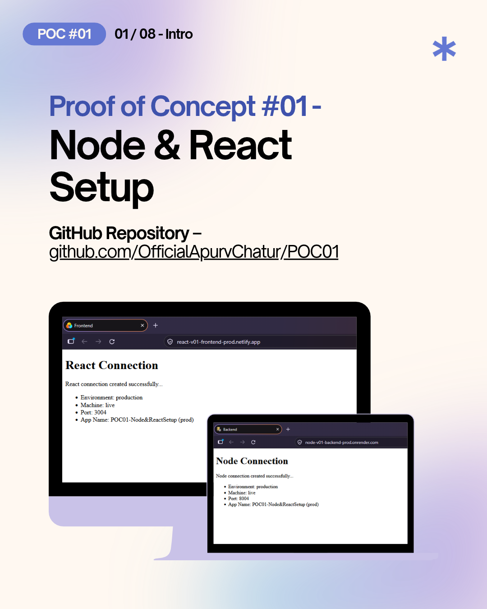
  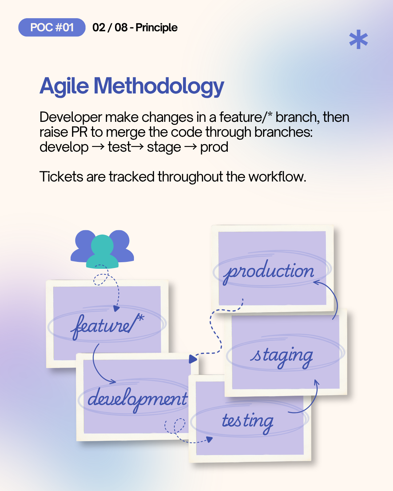
  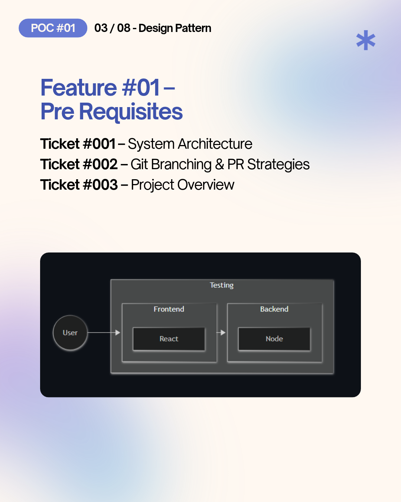
  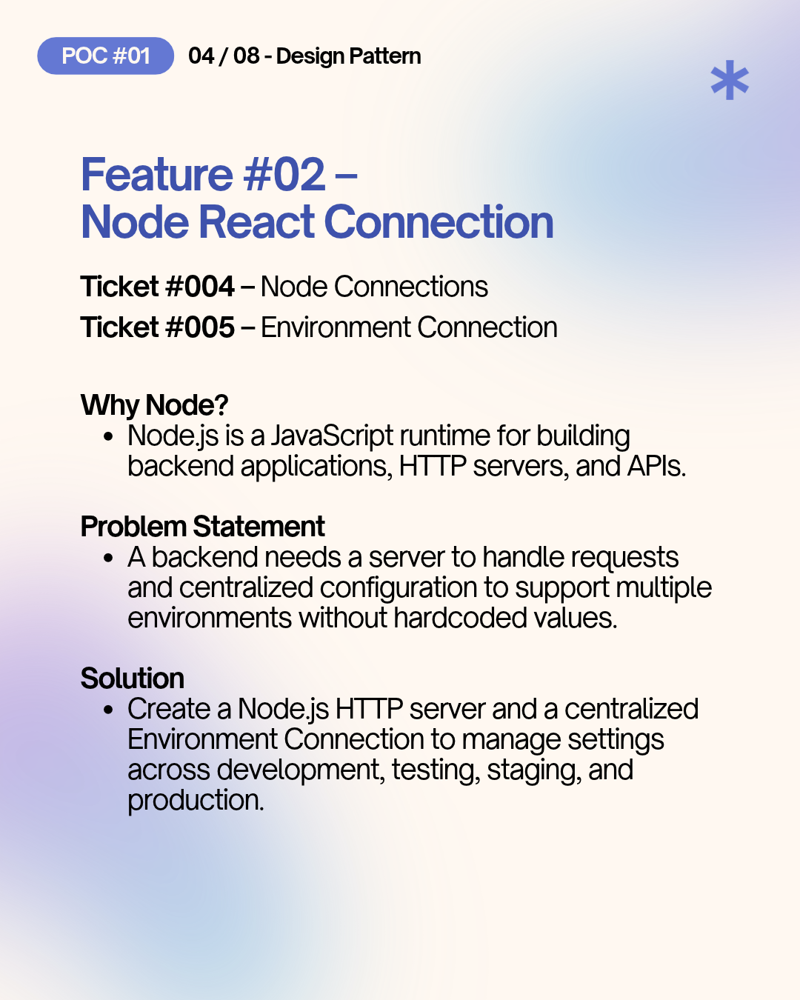
  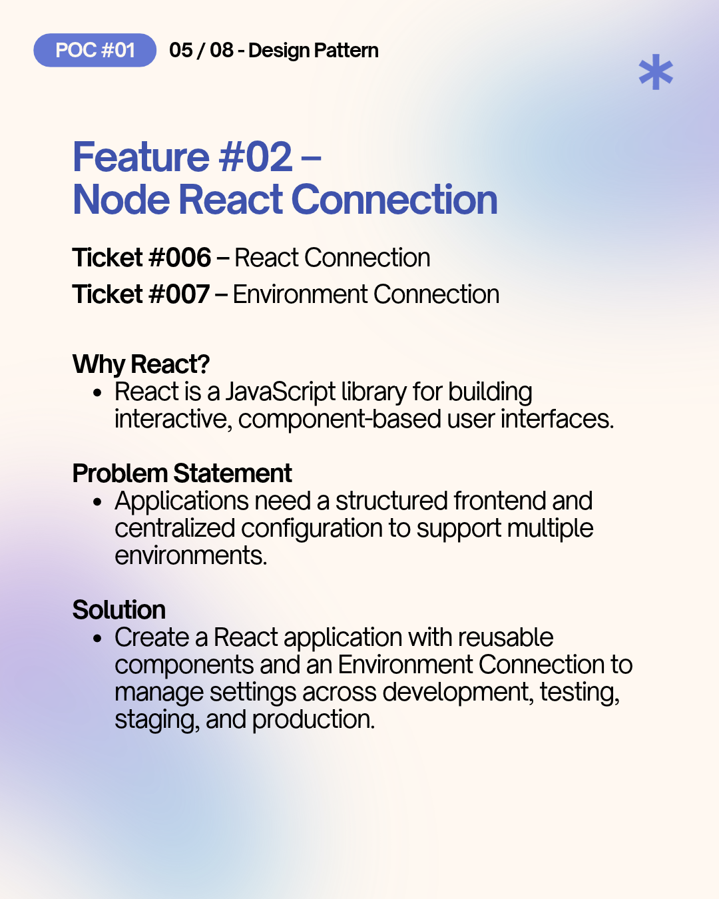
  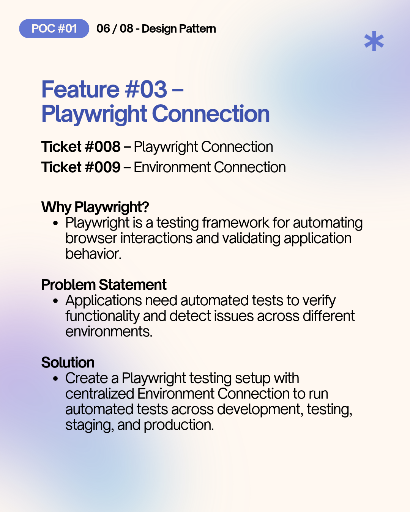
  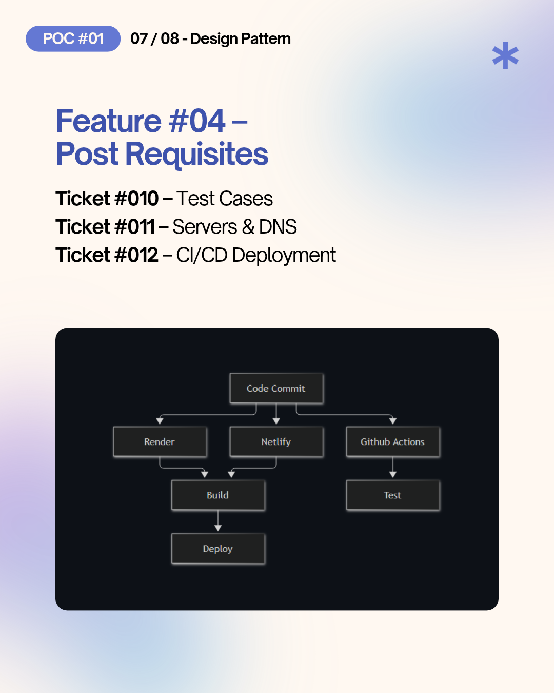
  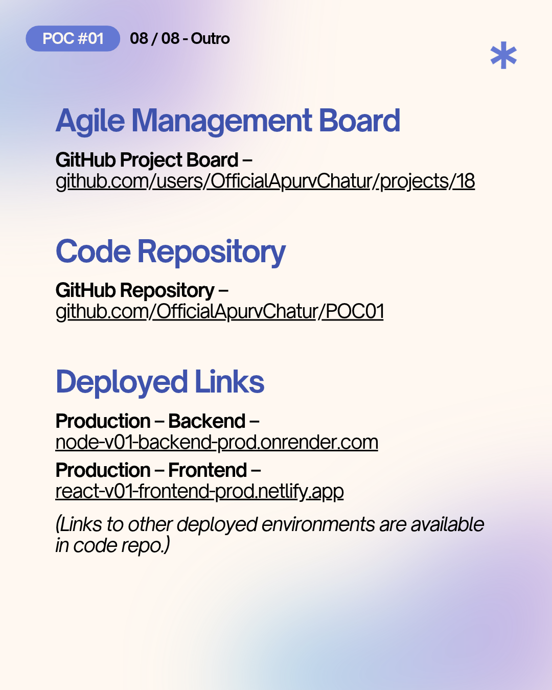

